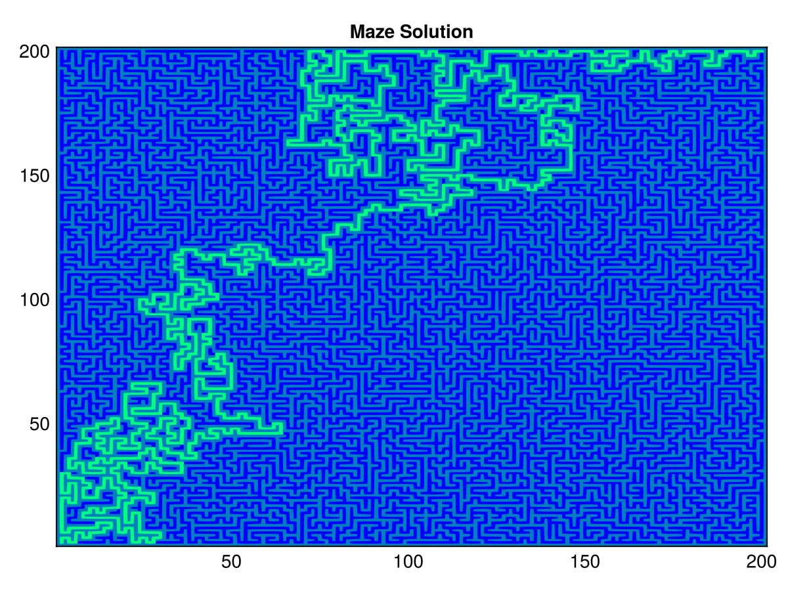

# Maze Pathfinding Example

This example shows how to use AStarSearch.jl to solve a simple maze pathfinding problem. The complete code can be found in the [`examples/maze.jl`](https://github.com/PaoloSarti/AStarSearch.jl/blob/main/examples/maze.jl) file in the repository.

We'll represent the maze as a 2D grid where `true` represents walls and `false` represents open paths.

## Problem Setup

We'll use `CartesianIndex` to represent positions in the maze:

```julia
const UP = CartesianIndex(-1, 0)
const DOWN = CartesianIndex(1, 0)
const LEFT = CartesianIndex(0, -1)
const RIGHT = CartesianIndex(0, 1)
const DIRECTIONS = [UP, DOWN, LEFT, RIGHT]
```

## Neighbor Generation

For each position in the maze, we need to generate valid neighboring positions:

```julia
function mazeneighbours(maze, p)
  res = CartesianIndex[]
  for d in DIRECTIONS
    n = p + d
    # Check if neighbor is within bounds and not a wall
    if 1 ≤ n[1] ≤ size(maze)[1] && 1 ≤ n[2] ≤ size(maze)[2] && !maze[n]
      push!(res, n)
    end
  end
  return res
end
```

## Heuristic Function

We'll use Manhattan distance as our heuristic:

```julia
manhattan(p, s) = abs(p[1] - s[1]) + abs(p[2] - s[2])
```

## Solving the Maze

Putting it all together:

```julia
using AStarSearch

# Create a maze (true = wall, false = path)
maze = [
  0 0 1 0 0
  0 1 0 0 0
  0 1 0 0 1
  0 0 0 1 1
  1 0 1 0 0
] .== 1

# Define start and goal positions
start = CartesianIndex(1, 1)
goal = CartesianIndex(1, 5)

# Helper function to solve the maze
function solvemaze(m, s, g)
  return astar(p -> mazeneighbours(m, p), s, g; heuristic = manhattan)
end

# Find the path
result = solvemaze(maze, start, goal)

if result.status == :success
  println("Path found with length $(result.cost)!")
  # Print the path
  for position in result.path
    println(position)
  end
else
  println("No path found to goal!")
end
```

## Visualizing the Solution

Here's a simple way to visualize the path in the maze:

```julia
function printmaze(maze, path)
  chars = fill('.', size(maze))
  chars[maze] .= '█'

  # Mark the path with numbers
  for (i, pos) in enumerate(path)
    chars[pos] = '*'
  end

  # Print the maze
  for row in eachrow(chars)
    println(join(row))
  end
end

# Example visualization
printmaze(maze, result.path)
```

This will produce output like:

```
*....
*█*.
*█*.█
**.██
█*█..
```

## Visual Example

The example code includes a function to generate and visualize random mazes with their solutions using GLMakie:



This image shows a 100×100 maze with the solution path highlighted. The gray areas represent the walls, while the green line shows the shortest path found by the A* algorithm.

This example demonstrates how AStarSearch.jl can be used for grid-based pathfinding problems. The same approach can be extended to more complex grids, different movement patterns, or custom cost functions.
